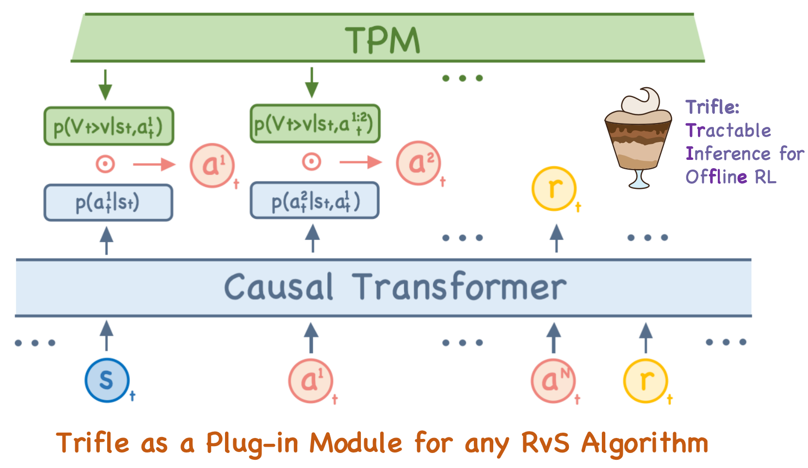

# Trifle (Tractable Inference for Offline RL)

Code release for [A Tractable Inference Perspective of Offline RL](https://openreview.net/pdf?id=UZIHW8eFRp)




## Installation

This implementation of Trifle builds upon [TT-repo](https://github.com/jannerm/trajectory-transformer.git). Before proceeding, ensure you have installed the base environments following the instructions in the TT-repo.

### **1. Install a compatible version of `pyjuice`**

```bash
git clone https://github.com/Tractables/pyjuice
cd pyjuice
git checkout 293fdc1e2f7967df4f981880e38ad5ca187bcbc7
pip install -e .
```

### **2. Install Trifle**

```bash
cd Trifle/
pip install -e .
```

## Usage

To reproduce the results of TT-based Trifle, run the following command:

```bash
python scripts/plan.py --dataset halfcheetah-medium-v2
```

By default, these commands will utilize the hyperparameters specified in [`config/plan_conf.py`](config/plan_conf.py). You can modify these parameters at runtime using command-line arguments:

```bash
python scripts/plan.py --dataset halfcheetah-medium-v2 \
    --horizon 10 --beam_width 64 --top_ratio 0.15
```

## Pretrained Models for TT-based Trifle

The [TT-repo](https://github.com/jannerm/trajectory-transformer.git) provides pretrained GPT models, which can be downloaded into `logs/$DATASET/gpt/pretrained`.

For the pretrained probabilistic circuit (PC) models used in Trifle, the code will automatically download them from [Hugging Face](https://huggingface.co/liebenxj/pretrained_pc).

## Reference

```
@inproceedings{liutractable,
  title={A Tractable Inference Perspective of Offline RL},
  author={Liu, Xuejie and Liu, Anji and Van den Broeck, Guy and Liang, Yitao},
  booktitle={The Thirty-eighth Annual Conference on Neural Information Processing Systems}
}
```
